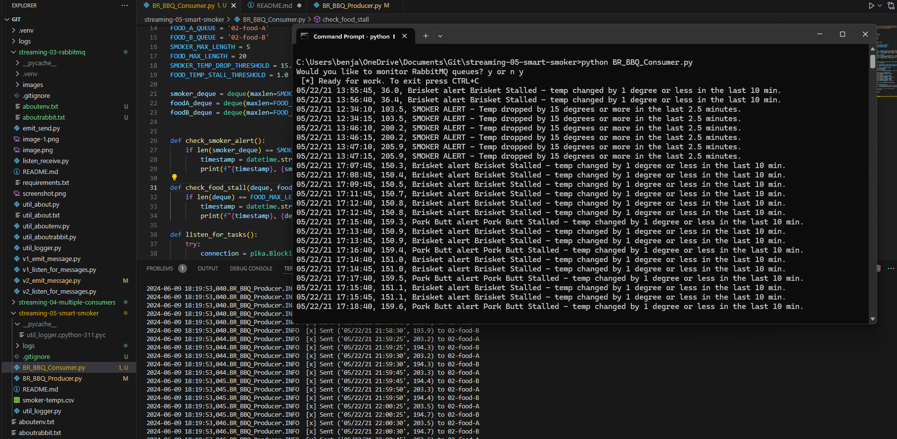

# 

## Ben Robin 5/17/2024

# streaming-05-smart-smoker

> Creating my own repo to complete the following tasks 

1. Implement your bbq producer. More detailed help provided in links below. 
2. Use the logic, approach, and structure from Module 4, version 2 and version 3.
3. These provide a current and solid foundation for streaming analytics - modifying them to serve your purpose IS part of the assignment.
4. Do not start from scratch - do not search for code - do not use a notebook.
5. Use comments in the code and repo to explain your work. 
6. Use docstring comments and add your name and date to your README and your code files. 
7. Explain your project in the README. Include prerequisites and how to run your code. 
8. Document your project works - display screenshots of your console and maybe the RabbitMQ console. 
9. If you only have a producer, you won't have a consumer showing messages yet, so you'll need to be creative. We'll build the consumers next.

## Before You Begin

1. In GitHub, create a new repo for your project - name it streaming-05-smart-smoker. ✓
2. Add a README.md during the creation process. (If not, you can always add it later.) ✓
3. In VS Code, add a .gitignore (use one from an earlier module), start working on the README.md. Create it if you didn't earlier. ✓ 
4. Add the csv data file to your repo.  ✓ 
5. Create a file for your bbq producer.  ✓

## Read

1. To be guided through the producer design, read https://nwmissouri.instructure.com/courses/60464/pages/module-5-dot-1-guided-producer-design?wrap=1  ✓
2. For a bit more guidance on the coding implementation, read https://nwmissouri.instructure.com/courses/60464/pages/module-5-dot-2-guided-producer-implementation?wrap=1 ✓

## Guided Producer Design  

If this is the main program being executed (and you're not importing it for its functions),
We should call a function to ask the user if they want to see the RabbitMQ admin webpage.
We should call a function to begin the main work of the program.
As part of the main work, we should
Get a connection to RabbitMQ, and a channel, delete the 3 existing queues (we'll likely run this multiple times), and then declare them anew. 
Open the csv file for reading (with appropriate line endings in case of Windows) and create a csv reader.
For data_row in reader:
[0] first column is the timestamp - we'll include this with each of the 3 messages below
[1] Channel1 = Smoker Temp --> send to message queue "01-smoker"
[2] Channe2 = Food A Temp --> send to message queue "02-food-A"
[3] Channe3 = Food B Temp --> send to message queue "02-food-B"
Send a tuple of (timestamp, smoker temp) to the first queue
Send a tuple of (timestamp, food A temp) to the second queue
Send a tuple of (timestamp, food B temp) to the third queue 
Create a binary message from our tuples before using the channel to publish each of the 3 messages.
Messages are strings, so use float() to get a numeric value where needed
 Remember to use with to read the file, or close it when done.
 

## Producer Design Questions
Can the open() function fail?
What do we do if we know a statement can fail? Hint: try/except/finally
Does our data have header row? BR- yes 
What happens if we try to call float("Channel1")?  BR -There are gaps so it errors out. 
How will you handle the header row in your project?  "reader = csv.DictReader(csvfile) for data_row in reader:" this function skips the header row. 
Will you delete it (easy), or use code to skip it (better/more difficult)? skip it
If that's enough to  get started on implementation, please do so. To be guided through implementation, please continue reading.

## Producer Implementation Questions/Remarks

Will you use a file docstring at the top? Hint: yes
Where do imports go? Hint: right after the file/module docstring ✓
After imports, declare any constants. ✓
After constants, define functions. ✓
Define a function to offer the RabbitMQ admin site, use variables to turn it off temporarily if desired. ✓
Define a main function to
connect,
get a communication channel, ✓
use the channel to queue_delete() all 3 queues  ✓
use the channel to queue_declare() all 3 queues ✓
open the file, get your csv reader, for each row, use the channel to basic_publish() a message ✓
Use the Python idiom to only call  your functions if this is actually the program being executed (not imported). ✓
If this is the program that was called: 
call your offer admin function()  ✓
call your main() function, passing in just the host name as an argument (we don't know the queue name or message yet) ✓

### streaming-06-smart-smoker Consumer portion
## Ben Robin 6/09/2024

Smart Smoker System
Read about the Smart Smoker system here: Smart Smoker
We read one value every half minute. (sleep_secs = 30)
smoker-temps.csv has 4 columns:

[0] Time = Date-time stamp for the sensor reading
[1] Channel1 = Smoker Temp --> send to message queue "01-smoker"
[2] Channe2 = Food A Temp --> send to message queue "02-food-A"
[3] Channe3 = Food B Temp --> send to message queue "02-food-B"
We want know if:

The smoker temperature decreases by more than 15 degrees F in 2.5 minutes (smoker alert!)
Any food temperature changes less than 1 degree F in 10 minutes (food stall!)
Time Windows

Smoker time window is 2.5 minutes
Food time window is 10 minutes
Deque Max Length

At one reading every 1/2 minute, the smoker deque max length is 5 (2.5 min * 1 reading/0.5 min)
At one reading every 1/2 minute, the food deque max length is 20 (10 min * 1 reading/0.5 min) 
Condition To monitor

If smoker temp decreases by 15 F or more in 2.5 min (or 5 readings)  --> smoker alert!
If food temp change in temp is 1 F or less in 10 min (or 20 readings)  --> food stall alert!
Requirements

RabbitMQ server running
pika installed in your active environment
RabbitMQ Admin

See http://localhost:15672/Links to an external site.
General Design 

How many producer processes do you need to read the temperatures: One producer, built last project.
How many listening queues do we use: three queues, named as listed above.
How many listening callback functions do we need (Hint: one per queue): Three callback functions are needed.
 

Task 1. Open Your Existing Project
On your machine, open your existing streaming-05-getting-started repo in VS Code.
Create a file for your consumer (or 3 files if you'd like to use 3 consumers).

In your callback function, make sure you generate alerts - there will be a smoker alert and both Food A and Food B will stall. 

Your README.md screenshots must show 4 concurrent processes:

Producer (getting the temperature readings)
Smoker monitor ✓
Food A monitor ✓
Food B monitor ✓
In addition, you must show at least 3 significant events.

Run each terminal long enough that you can show the significant events in your screenshots:

Visible Smoker Alert with timestamp
Visible Food A stall with timestamp
Visible Food B stall with timestamp
 
 